# django的搭建

## 安装

```python
pip install django==2.2.12
# 安装2.2.12版本的django
```
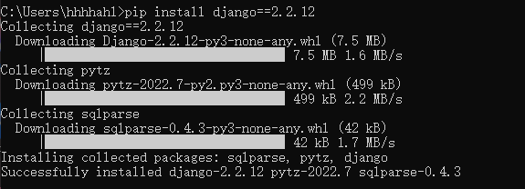

查看是否安装成功
```python
终端输入django-admin
```
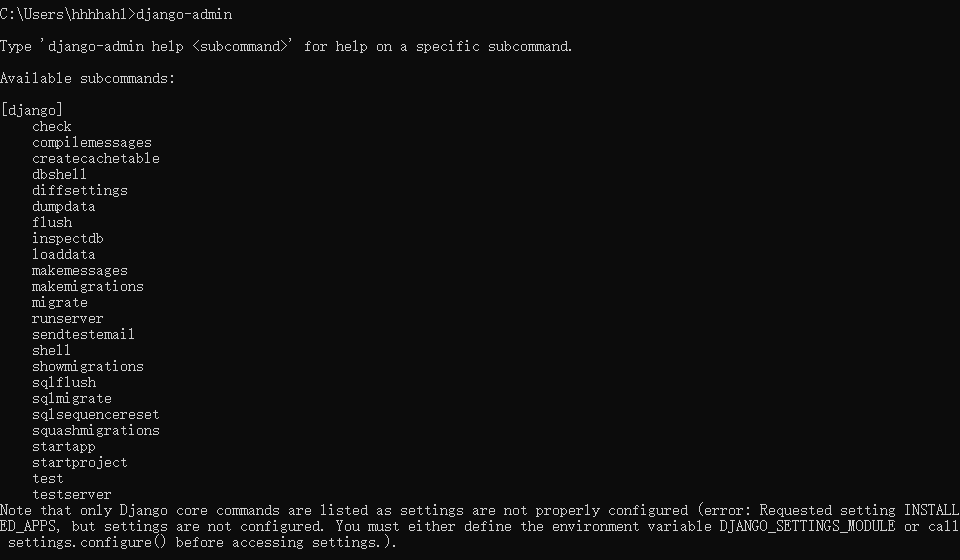


## 基本操作

### 命令行操作
#### 	1、创建项目
```python
# 切换到项目根目录下后输入以下命令
django-admin startproject 项目名
# 目录文件夹中就会创建一个项目文件夹
```
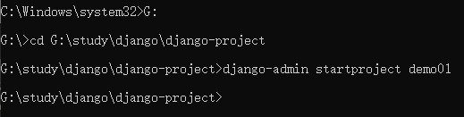
#### 	2、启动项目
```python
# 进入项目目录中
python manage.py runserver
```
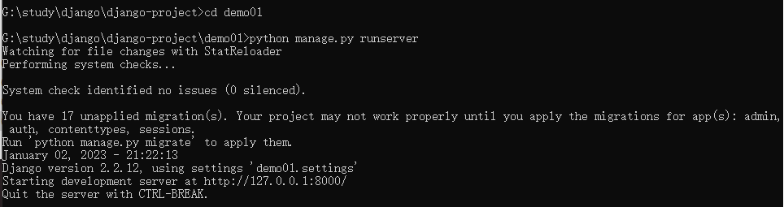

此时在浏览器中输入网址 "http://127.0.0.1:8000" / "localhost:8000"
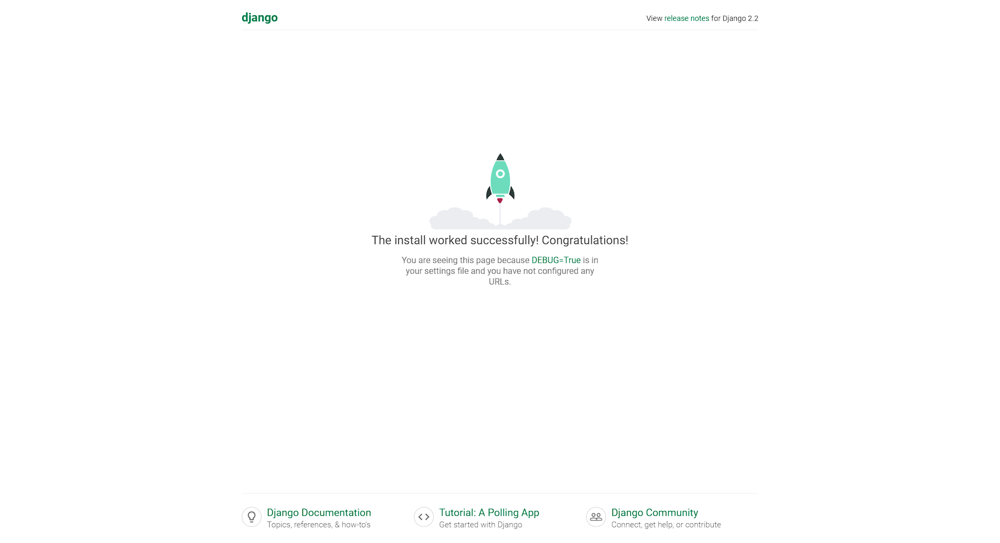

####	3、 创建应用
```python
# 进入项目目录中
python manage.py startapp 应用名
# 项目目录中就会创建一个应用文件夹
```
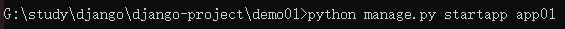


### pycharm操作
####	1、创建项目

​	**新建项目--**
​	1.选择Django
​	2.选择创建的位置（必须为空文件夹）
​	3.选择python项目环境
​	4.创建项目的同时创建一个项目应用（pycharm只能创建一个app）
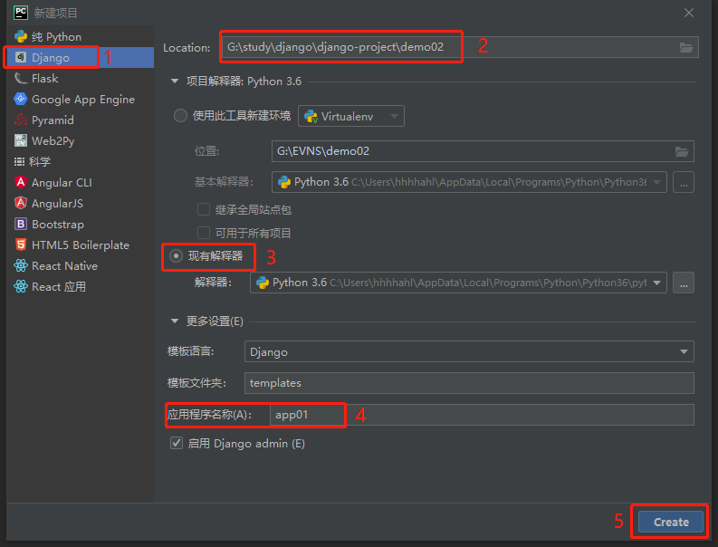

**注！**

​	*1、用命令行创建的应用需要在配置文件settings.py中注册才能使用，*
​	*pycharm自动创建的第一个应用，django会自动注册 --- 注册可以全称也可以简写*
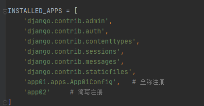

​	*2、用命令行创建的项目时不会自动创建templates文件夹，需要手动创建*
​	*pycharm创建项目时则会自动创建，并且会在配置文件中配置好对应的路径*
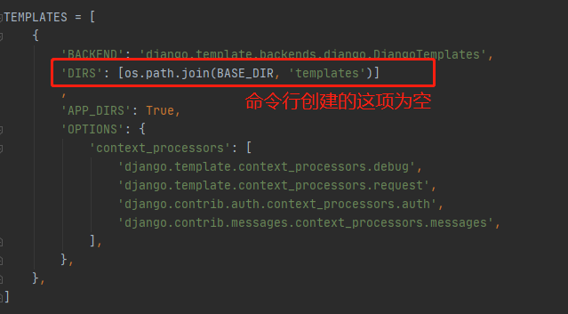


#### 	2、启动项目

1、可以用命令行启动 、
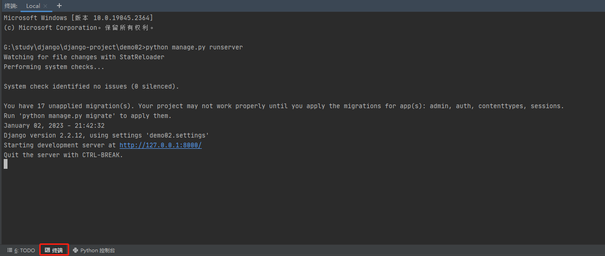
2、也可以点击pycharm右上角的绿色箭头启动（但是必须执行的是整个django项目）
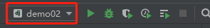

