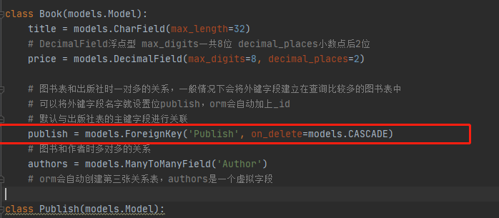
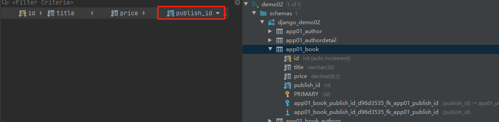
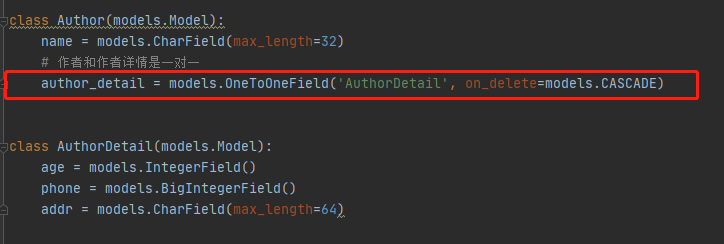
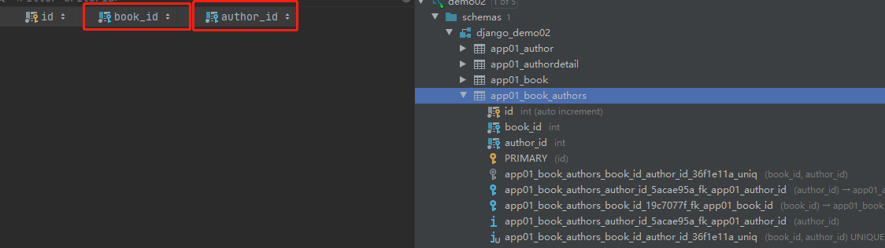
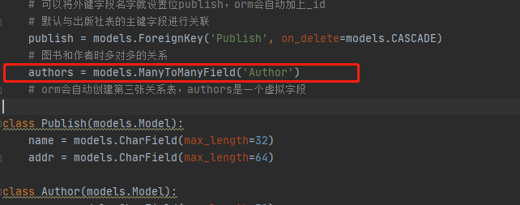

# django orm 中创建关系表

**图书表，出版社表，作者表，作者详情表**
```
    图书表和出版社表是一对多的关系
    图书表和作者表是多对多的关系
    作者表和作者详情表是一对一的关系
```

**orm创建表时不需要写id，会自动创建id，是一个自增的主键字段。**

外键字段设置：ForeignKey(一对多关系)，OneToOneField(一对一关系)，ManyToManyField(多对多关系)<br>
	1.to:要关联的表（必选参数）<br>
	2.to_filed:要关联的字段（可选-默认设置主键字段）<br>
	3.on_delete:当删除关联表中俄的数据时，当前表和关联表的行为<br>
		CASCADE(级联删除)<br>
		PROTECT(会报完整性的错误)<br>
		SET_NULL(会将外键字段自动设置位空，前提允许为空)<br>
		SET_DEFAULT(会给外键设置默认值)<br>
		
**这是图书表与出版社表的代码和数据库**



**这是作者表与作者详情的代码和数据库**



**这是图书表与作者表的代码和数据库**



