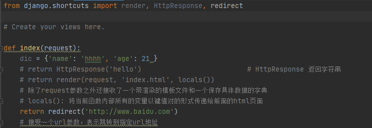
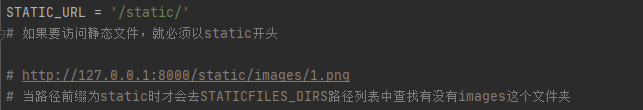

# django路由层

### url：统一资源定位符

```python
	互联网上每个文件都有一个唯一的url，它包含的信息指出文件的位置以及浏览器该怎么处理
	语法：
# https://baike.baidu.com/item/%E7%99%BE%E5%BA%A6/6699?fr=aladdin#4_2
		protocol://hostname[:port]/path/[?query][#fragment]
		protocol：协议（常用的有http/https）
		hostname：主机
		port：端口号
		path：路由地址，由零个或多个"/"来隔开的字符串，一般用来表示主机上的一个目录或者文件地址
		query：查询，参数。用于给动态网页传递参数，可以有多个参数，用"&"隔开的键值对。
        fragment:信息片段，字符串。例:网页中多个名词解释可使用fragment直接定位到某个名词的解释
	# 注：[]表示其中内容可以省略
```


### django如何处理一个url对应的请求

http://127.0.0.1:8000/page/2023

```
	1.django从配置文件中根据ROOT_URLCONF找到主路由文件(url.py)(默认该文件在项目同名目录下的urls)
    2.django加载主路由文件中的urlpatterns变量
    3.依次匹配urlpatterns中的url，匹配到第一个合适的及中断后续匹配
    4.匹配成功-->调用对应的试图函数处理请求，返回响应
    5.匹配失败-->返回400响应
```

### 三个试图函数的返回方法

HttpResponse():返回字符串类型的数据
render():返回html文件
reidirect():重定向



### 静态文件配置

默认将html文件放在templates文件夹下<br>
静态文件：前端已经写好了的，能够直接调用的文件（js，css，images，框架等）<br>
默认将网站使用的静态文件放在static文件夹下（需在配置文件中配置路径）<br>



### 静态文件动态解析

格式: <br>


**此时的STAIC_URL可以随便改**


### request()对象

**request.method():** 返回请求方式(大写的字符串形式)，例:GET，POST<br>
**request.POST:**获取用户提交post请求的数据<br>
**request.POST.get():**获取列表中最后一个元素<br>
**request.POST.getlist():**获取整个列表<br>
**request.Get:**获取用户提交get请求的数据<br>
**request.Get.get():**获取列表中最后一个元素<br>
**request.Get.getlist():**获取整个列表<br>
**request.FILES:**获取到post请求文件对象<br>
**request.path:**获取请求路由后缀<br>
**request.path_info:**获取请求路由后缀<br>
**request.get_full_path():**获取请求路由完整url以及?后的参数<br>


### path()函数

​	**用于描述路由和视图函数的对应关系**

```  python
    path(路由，视图函数，别名)
    path(route, views, name=None)
    route: 字符串类型，匹配请求的路径
    views：指定路径所对应的视图函数的名词
    name：为地址起别名，在模块中地址反向解析时使用
   	# url后面的/，django会自动帮你加上去匹配
    # 取消自动加/
    	# 在setting.pt中加上 APPEND_SLASH = False 默认是自动加斜杠
    
```


#### 反向解析

​	通过一些方法得到一个结果，该结果可以直接访问对应的url触发的视图函数

``` python
	# 给路由起个别名 name='ooo'
	path('func/', view.func, name='ooo')
```
``` html
	<!-- 前端反向解析 -->
	<a herf=''>111</a>
```
``` python
from django.shortcuts import reverse
    # 后端反向解析
	print(reverse('ooo'))
```
*当起了别名后，无论前面的路由路径怎么修改，反向解析路由别名即可。*

#### re_path()

```  python
    用于正则表达式去匹配路由
    re_path(reg, view, name)
    # reg:正则表达式
    # 正则表达式是一个特殊的字符序列，能够帮助你检查一个字符串是否与某种模式匹配
```
```
	^:匹配字符串的开头‘^1‘
	$:匹配字符串的末尾
	[...]:用来表达一组字符
	[^...]:匹配不在[]的字符
	*:0个或多个
	+:1个或多个
	{n}:匹配n个前面的表达式
	():对表达式进行分组
	/w:匹配字母数字下划线
	/W:匹配非字母数字下划线
	/d:匹配任意数字[0-9]
	/D:匹配非数字
	/s:匹配空白字符
	/S:匹配非空字符
```
re模块是python提供正则表达式功能的
```	python
	# re.match(匹配的正则，字符串)匹配字符串开始的字符
	re.math('www','www.baidu,com').span()		# (0, 3)
	re.math('com','www.baidu,com').span()		# error
    # re.search(匹配的正则，字符串)匹配字符串字符
	re.search('www','www.baidu,com').span()		# (0, 3)
    re.search('com','www.baidu,com').span()		# (10, 13)
    # span():查询匹配到的字符的索引
    # compile():用于编译正则表达式，生成一个正则表达式，供match和search函数使用
```

#### 无名分组
```	python
	re_path('test/(/d+)', views.test)												# 单个参数
    re_path('test/(/d+)/(/d+)/(/d+)', views.test)									# 多个参数
	# 正则匹配会将括号内的内容当作位置参数传递给视图函数
-----------------------------------------------------------------------view.py
    def test(request, x):															# 接收单个参数
        pass
    def test(request, x, y, z):														# 接收多个参数
        pass
```
​	**反向解析(无名分组)**

```	python
	re_path('test/(/d+)', views.test, name='xxx')
```
``` html
	<!-- 前端反向解析 -->
	<a herf=''>111</a>
```
``` python
from django.shortcuts import reverse
    # 后端反向解析
	print(reverse('xxx'), args=(123, ))
```

#### 有名分组

```	python
	re_path('(?P<year>/d+)/', views.test)											# 单个参数
    re_path('(?P<year>/d+)/(?P<mouth>/d+)/(?P<day>/d+)/', views.test)				# 多个参数
	# 有名分组时将括号内正则匹配到的内容当作关键字参数传递给视图函数
-----------------------------------------------------------------------view.py
    def test(request, year):
        pass
    def test(request, year, mouth, day):
        pass
```
​	**反向解析(有名分组)**

```	python
	re_path('(?P<year>/d+)/', views.test, name='yyy')												
```
``` html
	<!-- 前端反向解析 -->
	<a herf=''>111</a>
	<a herf=''>222</a>
```
``` python
from django.shortcuts import reverse
    # 后端反向解析
	print(reverse('yyy'), args=(123, ))
    print(reverse('yyy'), kwargs={'year': 123})
```
*有名分组和无名分组不能混用！！！*

## 路由分发

通过include方法进行路径分发，利用路由分发之后，总路由就不再干路由和视图的之间对于关系了，而是做分发处理，识别当前的url是属于哪个应用的，直接交给那个应用去处理

**总路由urls.py**

```python
from django.contrib import admin
from django.urls import path, include
from app01 import urls as app01_url				# 导入应用的urls as起别名
from app02 import urls as app02_url				

urlpatterns = [
    path('admin/', admin.site.urls),
    path('app01/', include(app01_url)),
    path('app02/', include(app02_url)),
]
```

```python
from django.contrib import admin
from django.urls import path, include			

urlpatterns = [
    path('admin/', admin.site.urls),
    path('app01/', include('app01.urls')),		# 直接字符串引入
    path('app02/', include('app02.urls')),
]
```
**应用urls.py**
```python
from django.urls import path
from app01 import views							# 导入应用的视图view.py

urlpatterns = [
    path('index/', views.index),
    path('login/', views.login),
    path('register/', views.register),
]
```
