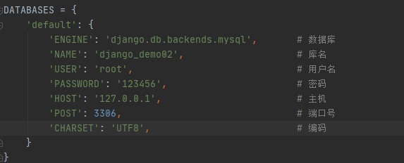
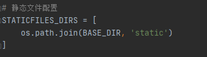

# settings.py配置介绍
**BASE_DIR:** 项目根目录项目路径<br>
**DEBUG:**用于配置django项目的启动调试 -- True（启动调试-显示报错）/ False（不启动调试）
**ALLOWED_HOSTS:**

```
	[]：空列表表示只有 127.0.0.1 / localhost 能够访问本项目
	['*']: 表示任何亲求主机都能访问当前项目
	['...','...','...']:表示只有列表中的主机能够访问本项目
```
**INSTALLED_APPS:**注册的app<br>
**MIDDLEWARE:**中间件<br>
**ROOT_URLCONF:**用于配置根级URL（项目同名文件下的urls.py）<br>
**TEMPLATES:** html文件存放路径配置<br>
**DATABASES:**项目指定数据库<br>
<br>
**STATIC_URL:**静态文件路由前缀 <br>
<br>
**STATICFILES_DIRS:**静态文件配置<br>


