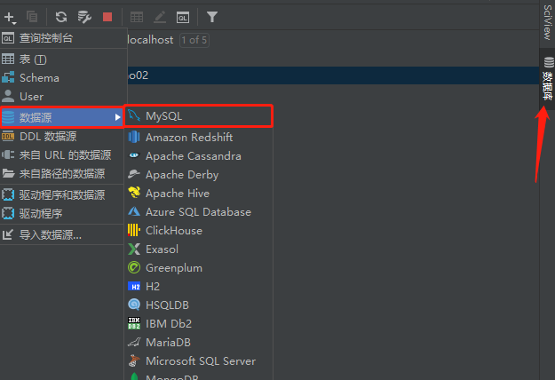
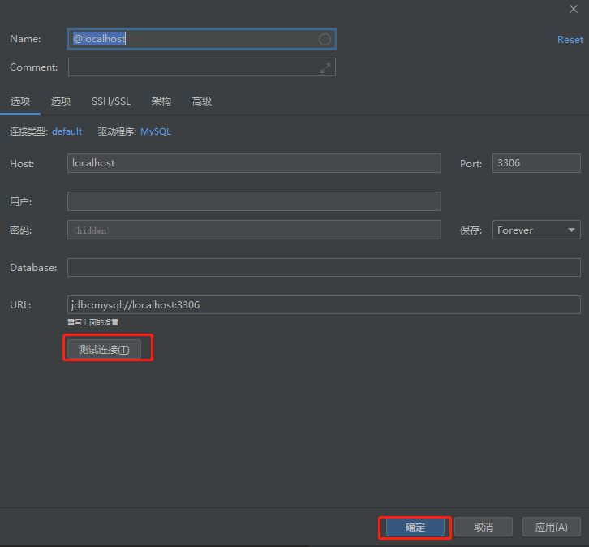
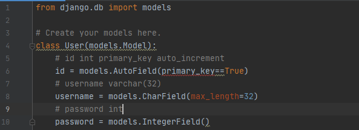
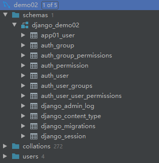

# django-数据库操作

### pycharm链接数据库

**住！mysql不要低于5.5版本**

```python
# 项目setting同级位置初始化文件中进行pymsql初始化配置即可
from pymysql import install_as_MySQLdb
install_as_MySQLdb()
# 将pymysql转换的mysqldb，即可不用下载mysqlclient
# python访问mysql需要安装对应的驱动包，
# 即将mysql的API接口转换成python格式供数据库应用软件开发者直接调用的第三方库.django2.2默认使用mysqlclient这个库去连接mysql
```

选择数据库(databases)，选数据源(Data Source)mysql



正常填写主机、端口、用户、密码、库名，之后点击测试链接，测试成功点击确定即可。

### django链接数据库

进入setting.py配置文件
**DATABASES:**项目指定数据库


### 数据库操作

#### 创建表

在models.py里配置<br>


#### 数据库迁移

将操作记录记录到migrations文件夹中
```
	python manage.py makemigrations
```
将操作同步到数据库
```
	python manage.py migrate
```

迁移之后会多出很多的表，这些事django默认需要的。<br>
<br>
**住！只有修改了models.py中跟数据相关的代码，就必须重复执行数据迁移两条命令**
